Math 50 Fall 2017, Final Project
================

#### In this project you will use the below data for house values in the city of Boston.

The `Boston` data frame has 506 rows and 13 columns.
“<https://math.dartmouth.edu/~m50f17/Boston.csv>”

This data frame contains the following columns:

`crim`: per capita crime rate by town.

`zn`: proportion of residential land zoned for lots over 25,000 sq.ft.

`indus`: proportion of non-retail business acres per town.

`chas`: Charles River dummy variable (= 1 if tract bounds river; 0
otherwise).

`nox`: nitrogen oxides concentration (parts per 10 million).

`rm`: average number of rooms per dwelling.

`age`: proportion of owner-occupied units built prior to 1940.

`dis`: weighted mean of distances to five Boston employment centres.

`rad`: index of accessibility to radial highways.

`tax`: full-value property-tax rate per $10,000.

`ptratio`: pupil-teacher ratio by town.

`lstat`: lower status of the population (percent).

`medv`: median value of the house in $1000s.

Your goal is to develop a model that predicts median value of the house (medv). You start with the multiple linear regression model using all of the 12 regressors (this is your base model). Answer the below questions.
In all parts write your model clearly. In addition to writing your justification clearly, print the critical values and display the plots you use.

1.  Fit a multiple linear regression model using all 12 regressors (base model).

``` r
data = read.table("https://math.dartmouth.edu/~m50f17/Boston.csv", header=T, sep=",")
medv = data$medv
crim = data$crim
zn= data$zn
indus= data$indus
chas= data$chas
nox= data$nox
rm= data$rm
age= data$age
dis= data$dis
rad= data$rad
tax= data$tax
ptratio= data$ptratio
lstat= data$lstat

model = lm(medv ~ crim + zn + indus + chas + nox + rm + age + dis + rad + tax + ptratio + lstat)
summary(model)
```

    ## Call:
    ## lm(formula = medv ~ crim + zn + indus + chas + nox + rm + age + 
    ##     dis + rad + tax + ptratio + lstat)
    ## 
    ## Residuals:
    ##      Min       1Q   Median       3Q      Max 
    ## -15.1304  -2.7673  -0.5814   1.9414  26.2526 
    ## 
    ## Coefficients:
    ##               Estimate Std. Error t value Pr(>|t|)    
    ## (Intercept)  41.617270   4.936039   8.431 3.79e-16 ***
    ## crim         -0.121389   0.033000  -3.678 0.000261 ***
    ## zn            0.046963   0.013879   3.384 0.000772 ***
    ## indus         0.013468   0.062145   0.217 0.828520    
    ## chas          2.839993   0.870007   3.264 0.001173 ** 
    ## nox         -18.758022   3.851355  -4.870 1.50e-06 ***
    ## rm            3.658119   0.420246   8.705  < 2e-16 ***
    ## age           0.003611   0.013329   0.271 0.786595    
    ## dis          -1.490754   0.201623  -7.394 6.17e-13 ***
    ## rad           0.289405   0.066908   4.325 1.84e-05 ***
    ## tax          -0.012682   0.003801  -3.337 0.000912 ***
    ## ptratio      -0.937533   0.132206  -7.091 4.63e-12 ***
    ## lstat        -0.552019   0.050659 -10.897  < 2e-16 ***
    ## ---
    ## Signif. codes:  0 '***' 0.001 '**' 0.01 '*' 0.05 '.' 0.1 ' ' 1
    ## 
    ## Residual standard error: 4.798 on 493 degrees of freedom
    ## Multiple R-squared:  0.7343, Adjusted R-squared:  0.7278 
    ## F-statistic: 113.5 on 12 and 493 DF,  p-value: < 2.2e-16

``` r
rStuRes = rstudent(model)
qqnorm(rStuRes, datax = TRUE, main="Normal Probability Plot - Base Model")
qqline(rStuRes, datax = TRUE)
```

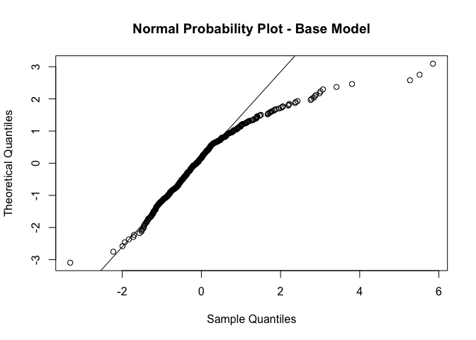<!-- -->

``` r
plot(fitted.values(model), rstudent(model), xlab = "y", ylab = "R-Student residuals", main = "Response vs. Residual Plot - Base Model")
abline(c(0,0), col="red")
```

<!-- -->

The base model has 12 regression coefficients noted above. The Adjusted R^sq value of 0.73 suggests the multiple linear regression model fits the data moderately well. F-test yields a high F-statistic and low p-value, so at least one of the regressors linearly predicts median house value, meaning the base model is useful.

2.  Give a model that uses base model and includes interaction terms crim×age, rm×tax, rm×ptratio, tax×ptratio, nox×crim, nox×age and 3 additional interaction terms of your choice. Check if any of these interaction terms contribute to the model. Eliminate the rest of the interaction terms.

``` r
model_interact = lm(medv ~ crim + zn + indus + chas + nox + rm + age + dis + rad + tax + ptratio + lstat + crim*age + rm*tax + rm*ptratio + tax*ptratio + nox*crim + nox*age + crim*lstat + dis*rad + zn*tax)
summary(model_interact)
```

    ## Call:
    ## lm(formula = medv ~ crim + zn + indus + chas + nox + rm + age + 
    ##     dis + rad + tax + ptratio + lstat + crim * age + rm * tax + 
    ##     rm * ptratio + tax * ptratio + nox * crim + nox * age + crim * 
    ##     lstat + dis * rad + zn * tax)
    ## 
    ## Residuals:
    ##     Min      1Q  Median      3Q     Max 
    ## -10.359  -2.378  -0.352   1.582  25.868 
    ## 
    ## Coefficients:
    ##               Estimate Std. Error t value Pr(>|t|)    
    ## (Intercept) -1.065e+02  2.176e+01  -4.894 1.34e-06 ***
    ## crim         3.692e-01  5.621e-01   0.657 0.511601    
    ## zn          -2.570e-02  4.276e-02  -0.601 0.548021    
    ## indus        1.402e-01  5.993e-02   2.339 0.019722 *  
    ## chas         3.458e+00  7.605e-01   4.547 6.89e-06 ***
    ## nox          3.026e+00  1.313e+01   0.230 0.817838    
    ## rm           2.244e+01  2.346e+00   9.566  < 2e-16 ***
    ## age          4.159e-02  6.986e-02   0.595 0.551900    
    ## dis         -4.537e-01  2.606e-01  -1.741 0.082310 .  
    ## rad          4.531e-01  1.046e-01   4.330 1.81e-05 ***
    ## tax          1.172e-01  3.374e-02   3.475 0.000557 ***
    ## ptratio      3.847e+00  1.176e+00   3.271 0.001148 ** 
    ## lstat       -4.744e-01  5.354e-02  -8.860  < 2e-16 ***
    ## crim:age     4.782e-03  3.341e-03   1.431 0.152983    
    ## rm:tax      -1.603e-02  2.236e-03  -7.168 2.86e-12 ***
    ## rm:ptratio  -6.236e-01  1.460e-01  -4.270 2.35e-05 ***
    ## tax:ptratio -1.775e-03  1.532e-03  -1.159 0.247133    
    ## crim:nox    -1.375e+00  7.294e-01  -1.885 0.060011 .  
    ## nox:age     -1.293e-01  1.448e-01  -0.893 0.372222    
    ## crim:lstat  -3.793e-03  4.396e-03  -0.863 0.388607    
    ## dis:rad     -6.582e-02  2.916e-02  -2.257 0.024462 *  
    ## zn:tax       1.316e-04  1.388e-04   0.948 0.343559    
    ## ---
    ## Signif. codes:  0 '***' 0.001 '**' 0.01 '*' 0.05 '.' 0.1 ' ' 1
    ## 
    ## Residual standard error: 4.147 on 484 degrees of freedom
    ## Multiple R-squared:  0.8052, Adjusted R-squared:  0.7967 
    ## F-statistic: 95.24 on 21 and 484 DF,  p-value: < 2.2e-16

``` r
model_interact_improved = lm(medv ~ crim + zn + indus + chas + nox + rm + age + dis + rad + tax + ptratio + lstat + rm*tax + rm*ptratio + dis*rad)
summary(model_interact_improved)
``` 
    ## Call:
    ## lm(formula = medv ~ crim + zn + indus + chas + nox + rm + age + 
    ##     dis + rad + tax + ptratio + lstat + rm * tax + rm * ptratio + 
    ##     dis * rad)
    ## 
    ## Residuals:
    ##      Min       1Q   Median       3Q      Max 
    ## -10.3638  -2.3544  -0.5184   1.5775  26.2854 
    ## 
    ## Coefficients:
    ##               Estimate Std. Error t value Pr(>|t|)    
    ## (Intercept) -81.376796  14.880058  -5.469 7.23e-08 ***
    ## crim         -0.171210   0.030430  -5.626 3.10e-08 ***
    ## zn            0.005189   0.012762   0.407 0.684488    
    ## indus         0.130775   0.055657   2.350 0.019186 *  
    ## chas          3.397200   0.761914   4.459 1.02e-05 ***
    ## nox         -12.244873   3.411621  -3.589 0.000365 ***
    ## rm           21.521406   2.181764   9.864  < 2e-16 ***
    ## age          -0.009403   0.011670  -0.806 0.420772    
    ## dis          -0.544271   0.240531  -2.263 0.024085 *  
    ## rad           0.387685   0.094271   4.112 4.59e-05 ***
    ## tax           0.074617   0.013147   5.676 2.37e-08 ***
    ## ptratio       3.268723   0.898751   3.637 0.000305 ***
    ## lstat        -0.534072   0.044525 -11.995  < 2e-16 ***
    ## rm:tax       -0.014266   0.002029  -7.032 6.88e-12 ***
    ## rm:ptratio   -0.632629   0.139769  -4.526 7.54e-06 ***
    ## dis:rad      -0.057411   0.027180  -2.112 0.035170 *  
    ## ---
    ## Signif. codes:  0 '***' 0.001 '**' 0.01 '*' 0.05 '.' 0.1 ' ' 1
    ## 
    ## Residual standard error: 4.174 on 490 degrees of freedom
    ## Multiple R-squared:  0.8001, Adjusted R-squared:  0.794 
    ## F-statistic: 130.8 on 15 and 490 DF,  p-value: < 2.2e-16

``` r
rStuRes = rstudent(model_interact_improved)
qqnorm(rStuRes, datax = TRUE, main="Normal Probability Plot - Significant Interaction Terms")
qqline(rStuRes, datax = TRUE)
```

<!-- -->

``` r
plot(fitted.values(model_interact_improved), rstudent(model_interact_improved), xlab = "y", ylab = "R-Student residuals", main = "Response vs. Residual Plot - Significant Interaction Terms")
abline(c(0,0), col="red")
```

<!-- -->

``` r
model_of_others = lm(medv ~ crim + zn + indus + chas + nox + rm + age + dis + rad + tax + ptratio + lstat + rm*tax + rm*ptratio + dis*rad)
SSr_ommited_terms_given_others = sum((predict(model_interact) - mean(medv))^2) - sum((predict(model_of_others) - mean(medv))^2)
n = length(medv)
k = 18
r = 3
MSres = sum((medv - predict(model_interact))^2)/(n-(k+1))
f_stat = SSr_ommited_terms_given_others/r/MSres
f_val = qf(0.95,r,n-(k+1))
```

I picked my additional interaction terms as crim\*lstat (maybe lower status leads to more crime?), dis\*rad (both pertain to travel), and crim\*ptratio (less contact between students and teacher hurting futures of citizens?). Running t-tests on the regression coefficients for the interaction terms will show which interaction terms are likely significant to the model or not. crim\*age, tax\*ptratio, crim\*nox, nox\*age, crim\*lstat, and zn\*tax gave insignificant results at the 5% alpha level (high p-values and low magnitude t-statistics), thus we eliminate them from the model. Note that upon running a joint significance test on the three interaction terms being removed I obtained a F-stat of 4.2070836 and F-val of 2.6232126. This significant result indicates that although individually the interaction terms may not be significant to the model, together they actually could have slightly improved the model. Studying the normality and residual plots before and after using interaction terms in the model, we see little to no improvement in the constant variance and normality (except slightly smaller tails) assumptions.

3.  Try various transformations on the base model, then propose a transformation (on prediction variable medv or on regressors) that you think it might be helpful to linearize the model (or to improve it). Then fit a model using this transformation.

``` r
medvRep = log(medv)
model_y_ln = lm(medvRep ~ crim + zn + indus + chas + nox + rm + age + dis + rad + tax + ptratio + lstat)
rStuRes = rstudent(model_y_ln)
qqnorm(rStuRes, datax = TRUE, main="Normal Probability Plot - ln(y)")
qqline(rStuRes, datax = TRUE)
```

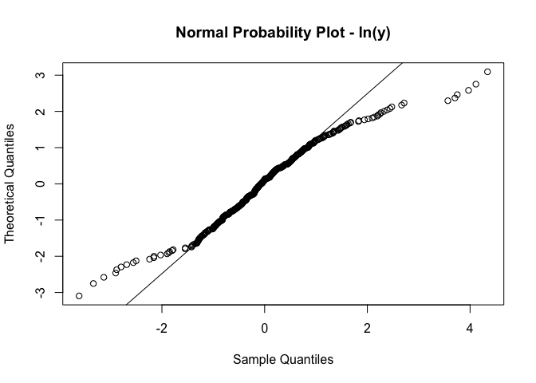<!-- -->

``` r
plot(fitted.values(model_y_ln), rstudent(model_y_ln), xlab = "y", ylab = "R-Student residuals", main = "Response vs. Residual Plot - ln(y)")
abline(c(0,0), col="red")
```

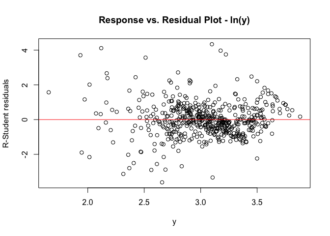<!-- -->

``` r
medvRep = 1/medv
model_y_inv = lm(medvRep ~ crim + zn + indus + chas + nox + rm + age + dis + rad + tax + ptratio + lstat)
rStuRes = rstudent(model_y_inv)
qqnorm(rStuRes, datax = TRUE, main="Normal Probability Plot - 1/y")
qqline(rStuRes, datax = TRUE)
```

<!-- -->

``` r
plot(fitted.values(model_y_inv), rstudent(model_y_inv), xlab = "y", ylab = "R-Student residuals", main = "Response vs. Residual Plot - 1/y")
abline(c(0,0), col="red")
```

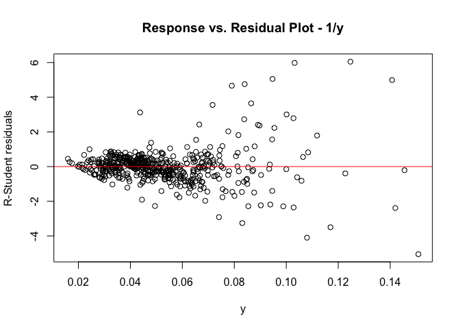<!-- -->

``` r
medvRep = medv^0.5
model_y_sqrt = lm(medvRep ~ crim + zn + indus + chas + nox + rm + age + dis + rad + tax + ptratio + lstat)
rStuRes = rstudent(model_y_sqrt)
qqnorm(rStuRes, datax = TRUE, main="Normal Probability Plot - root(y)")
qqline(rStuRes, datax = TRUE)
```

<!-- -->

``` r
plot(fitted.values(model_y_sqrt), rstudent(model_y_sqrt), xlab = "y", ylab = "R-Student residuals", main = "Response vs. Residual Plot - root(y)")
abline(c(0,0), col="red")
```

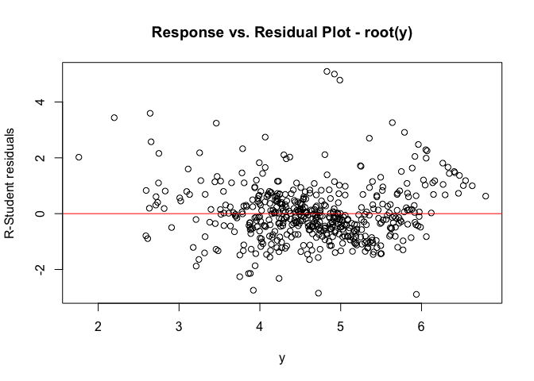<!-- -->

``` r
medvRep = medv^2
model_y_sq = lm(medvRep ~ crim + zn + indus + chas + nox + rm + age + dis + rad + tax + ptratio + lstat)
rStuRes = rstudent(model_y_sq)
qqnorm(rStuRes, datax = TRUE, main="Normal Probability Plot - y^2")
qqline(rStuRes, datax = TRUE)
```

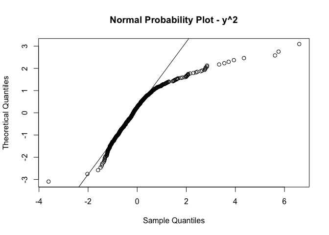<!-- -->

``` r
plot(fitted.values(model_y_sq), rstudent(model_y_sq), xlab = "y", ylab = "R-Student residuals", main = "Response vs. Residual Plot - y^2")
abline(c(0,0), col="red")
```

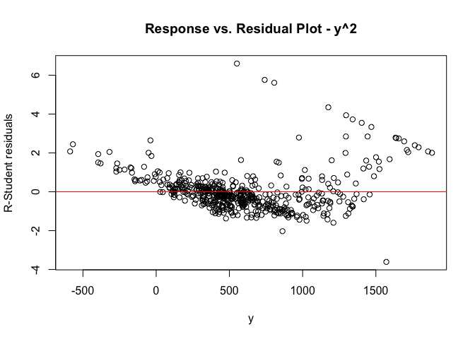<!-- -->

``` r
library(MASS)
bc = boxcox(medv ~ crim + zn + indus + chas + nox + rm + age + dis + rad + tax + ptratio + lstat)
```

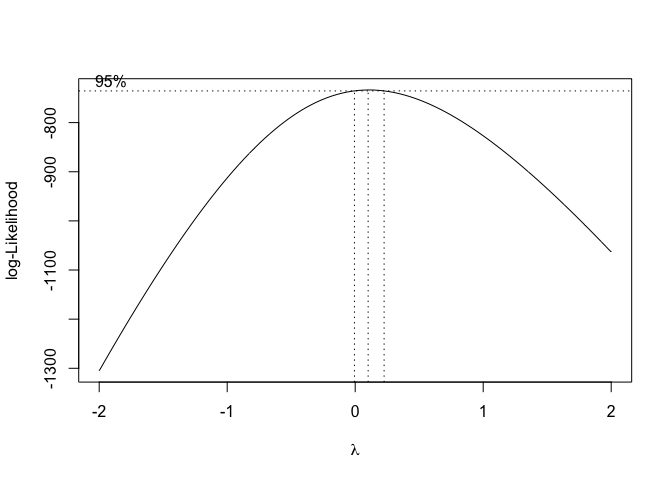<!-- -->

``` r
lambda <- bc$x[which.max(bc$y)]
```

After testing ln(y), 1/y, root(y), and y^2 as transformations on the response variable (plots shown above), the new normality plots did not make many improvements on the normality assumption. Moreover, instead of the residuals following the ideal line in the normality plot, ln(y) and 1/y transformation models displayed problematic heavy-tailed distributions, while root(y) and y^2 exhibited a practically identical normality plot to the base model (minor differences in tails). However, the residual plots for the ln(y) and root(y) transformations showed visible improvements in the constant-variance assumption from the original model. Finally for response variable transformations, I tried the Box-Cox method and evaluated an SSres-minimizing value of lambda = 0.1. Since lambda is so close to 0, it essentially suggests the ln(y) transformed model as the best choice (normality and residual plots are
nearly identical from before)

Finally I plotted externally studentized residuals against each regressor variable (graphs not shown due to shear number of them). None of the plots display a clear nonlinear figure, indicating we cannot be sure at this point that higher orders of regressors are necessary out of mis-specification. However, some regression plots have problems with the constant-variance assumption, particularly for regressor crim (variance increases w/ regressor), indus (variance increases, decreases, then increases w/ regressor), rm (variance decreases then increases w/ regressor), and dis (variance increases w/ regressor).

4.  Eliminate 6 of the regressors from the base model, that (you think) are the least significant ones. (You can do a subjective choice, considering the nature of the data, as long as you support it. For example you can make a few joint significance test to support your choice). Now using the remaining 6 regressors propose a polynomial model that includes quadratic terms and interaction terms. Then fit this model.

``` r
summary(model)
```

    ## Call:
    ## lm(formula = medv ~ crim + zn + indus + chas + nox + rm + age + 
    ##     dis + rad + tax + ptratio + lstat)
    ## 
    ## Residuals:
    ##      Min       1Q   Median       3Q      Max 
    ## -15.1304  -2.7673  -0.5814   1.9414  26.2526 
    ## 
    ## Coefficients:
    ##               Estimate Std. Error t value Pr(>|t|)    
    ## (Intercept)  41.617270   4.936039   8.431 3.79e-16 ***
    ## crim         -0.121389   0.033000  -3.678 0.000261 ***
    ## zn            0.046963   0.013879   3.384 0.000772 ***
    ## indus         0.013468   0.062145   0.217 0.828520    
    ## chas          2.839993   0.870007   3.264 0.001173 ** 
    ## nox         -18.758022   3.851355  -4.870 1.50e-06 ***
    ## rm            3.658119   0.420246   8.705  < 2e-16 ***
    ## age           0.003611   0.013329   0.271 0.786595    
    ## dis          -1.490754   0.201623  -7.394 6.17e-13 ***
    ## rad           0.289405   0.066908   4.325 1.84e-05 ***
    ## tax          -0.012682   0.003801  -3.337 0.000912 ***
    ## ptratio      -0.937533   0.132206  -7.091 4.63e-12 ***
    ## lstat        -0.552019   0.050659 -10.897  < 2e-16 ***
    ## ---
    ## Signif. codes:  0 '***' 0.001 '**' 0.01 '*' 0.05 '.' 0.1 ' ' 1
    ## 
    ## Residual standard error: 4.798 on 493 degrees of freedom
    ## Multiple R-squared:  0.7343, Adjusted R-squared:  0.7278 
    ## F-statistic: 113.5 on 12 and 493 DF,  p-value: < 2.2e-16

Based on t-tests on each of the 12 regressors in the model, we conclude at the 5% level that regression coefficients for indus and age are likely 0, indicating that they are not very useful in predicting median value of houses. Although t-tests for all other regressors yielded significant results, we see that the next largest p-values (in order) are for regressors chas, tax, zn, and crim. \[Consider how if confidence level alpha were to lower, we would be then able to eliminate these regressors in this sequence\]. Stepping back from the statistics, eliminating these 6 regressors makes some intuitive sense because it doesn’t make sense why towns with expensive houses would necessarily have largely retail or non-retail stores, or why having either historic or modern homes really matters to house value (at least in my mind). I was surprised about having to remove crime rate from the model because I thought towns with generally more valuable homes would experience more robbery, but I suppose accessibility to a metropolitan area could perhaps be crucial to obtaining high-paying jobs, leading to construction and ownership of valuable homes.

``` r
model_of_others = lm(medv ~ crim + zn + chas + nox + rm + dis + rad + tax + ptratio + lstat)
SSr_indus_age_given_others = sum((predict(model) - mean(medv))^2) - sum((predict(model_of_others) - mean(medv))^2)
n = length(medv)
k = 9
r = 2
MSres = sum((medv - predict(model))^2)/(n-(k+1))
f_stat_1 = SSr_indus_age_given_others/r/MSres
f_val_1 = qf(0.95,r,n-(k+1))

model_of_others_2 = lm(medv ~ nox + rm + dis + rad + ptratio + lstat)
SSr_6_removed_given_others = sum((predict(model) - mean(medv))^2) - sum((predict(model_of_others_2) - mean(medv))^2)
r = 6
f_stat_2 = SSr_6_removed_given_others/r/MSres
f_val_2 = qf(0.95,r,n-(k+1))
```

After removing indus and age from the model, my joint significance test gave an F-stat of 0.0604773 versus F-val of 3.0138989. We fail to reject the null hypothesis and conclude that jointly, the indus and age do not improve the model at the 5% level and are ok to remove. But after removing all 6 regressors together I obtained an F-stat of 7.7677486 versus F-val of 2.1168478. This time we reject the null hypothesis and claim that the regressors would better not be jointly omitted from the model. We will still remove these 6 regressors and move onwards, perhaps interaction and quadratic terms can improve the model.

``` r
polyfit = lm(medv~polym(nox,rm,dis,rad,ptratio,lstat,degree=2))
SQ_dis = dis^2
SQ_lstat = lstat^2
polymodel = lm(medv ~ nox + rm  + dis + lstat + SQ_dis + SQ_lstat + nox*rm + rm*ptratio + dis*rad + dis*lstat + rad*lstat)
summary(polymodel)
```

    ## Call:
    ## lm(formula = medv ~ nox + rm + dis + lstat + SQ_dis + SQ_lstat + 
    ##     nox * rm + rm * ptratio + dis * rad + dis * lstat + rad * 
    ##     lstat)
    ## 
    ## Residuals:
    ##      Min       1Q   Median       3Q      Max 
    ## -13.2827  -1.8688  -0.0502   1.8180  19.9548 
    ## 
    ## Coefficients:
    ##               Estimate Std. Error t value Pr(>|t|)    
    ## (Intercept) -1.434e+02  1.623e+01  -8.838  < 2e-16 ***
    ## nox          1.082e+02  1.571e+01   6.887 1.75e-11 ***
    ## rm           3.337e+01  2.387e+00  13.979  < 2e-16 ***
    ## dis         -4.285e+00  6.445e-01  -6.648 7.91e-11 ***
    ## lstat       -1.857e+00  1.541e-01 -12.048  < 2e-16 ***
    ## SQ_dis       2.013e-01  4.269e-02   4.715 3.15e-06 ***
    ## SQ_lstat     3.651e-02  3.288e-03  11.103  < 2e-16 ***
    ## ptratio      5.541e+00  6.623e-01   8.367 6.16e-16 ***
    ## rad          5.797e-01  9.955e-02   5.823 1.05e-08 ***
    ## nox:rm      -2.049e+01  2.542e+00  -8.060 5.83e-15 ***
    ## rm:ptratio  -9.741e-01  1.013e-01  -9.612  < 2e-16 ***
    ## dis:rad     -2.751e-02  2.398e-02  -1.147    0.252    
    ## dis:lstat    1.342e-01  2.123e-02   6.320 5.86e-10 ***
    ## lstat:rad   -3.066e-02  3.841e-03  -7.983 1.02e-14 ***
    ## ---
    ## Signif. codes:  0 '***' 0.001 '**' 0.01 '*' 0.05 '.' 0.1 ' ' 1
    ## 
    ## Residual standard error: 3.617 on 492 degrees of freedom
    ## Multiple R-squared:  0.8493, Adjusted R-squared:  0.8453 
    ## F-statistic: 213.3 on 13 and 492 DF,  p-value: < 2.2e-16

``` r
rStuRes = rstudent(polymodel)
qqnorm(rStuRes, datax = TRUE, main="Normal Probability Plot - POLY (Part d)")
qqline(rStuRes, datax = TRUE)
```

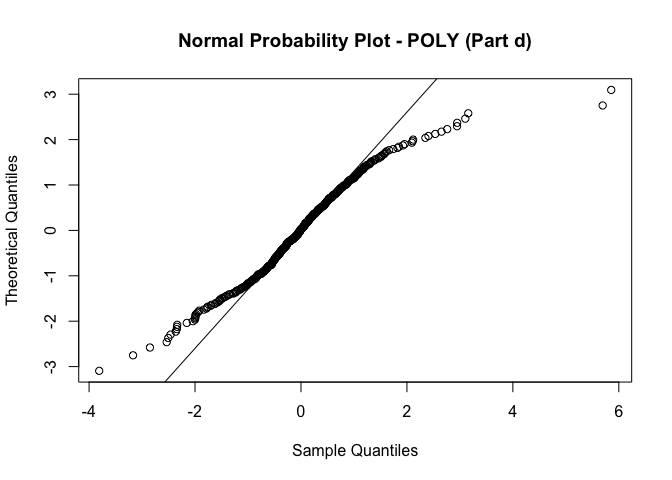<!-- -->

``` r
plot(fitted.values(polymodel), rstudent(polymodel), xlab = "y", ylab = "R-Student residuals", main = "Response vs. Residual Plot - POLY (Part d)")
abline(c(0,0), col="red")
```

<!-- -->

To build my polynomial model, I first regressed ALL quadratic, linear, and interaction terms using the 6 chosen regressors and response (full model not shown). After comparing contributions of each term on the model using t-statistics, I eliminated all terms that were not significant at the 5% level, meaning terms that likely have no effective contribution to the prediction of median house value. Given the principle of parsimony, I settled on a more modest polynomial model of degree 2 with 11 terms (each of these terms contributed significantly to the polynomial regression model at the 5% level). Upon plotting the normality and residuals plots for the polynomial model, we see a minor problem with the normality assumption as the tails deviate from the line, while constant variance is fulfilled.

5.  Compare the performance of the models in part (a) to (d). Look at various diagnostics we have seen. Also check for normality and constant variance violations. Make a comparison and support your comments with plots and statistics.

The base model from part a) was the most basic multiple linear regression model, resulting in a moderate fit to the data with an R-sq of around 0.7. The resulting normality plot indicated that errors may not be normally distributed, while the residual plot displayed non-constant variance (low variance in errors near the center and higher outwards). We sought improvement in the model by testing for the existence of significant interaction terms, leading to our model in part b). Although the increase R-sq to approx 0.8 suggests these additional terms improved the how well the regressors explain variation in medv, unfortunately I found no change in the normality of the errors in the new model. Since there continues to exist non-constant variance in the residual plot, the model is potentially in need of a transformation. Through trial and error in part c), I settled on ln(y) as a transformation on response. Though R-sq barely changed to 0.78, the tails on the normal probability plot tend a little closer to the line and the residual plot fits within horizon bands better, suggesting improvements to our error assumptions and allowing us to trust this model’s predictions more. Ultimately, the polynomial plot best fitted the data as its variety of regressors explained nearly 85% of the variation in medv, while also demonstrating greater normality in error (slightly flatter tails on the normality plot) and closer constance of variance of error (residuals are contained in relatively horizontal lines, ignoring potential outliers).

6.  Now considering all of the above, propose a new model different than the one in part a (try mixture of the suggestions above). Fit your model. Comment on overall adequacy of your model comparing with the ones above.

``` r
polyfit2 = lm(medv~polym(crim,zn,nox,rm,dis,rad,tax,ptratio,lstat,degree=2))
SQdis = dis^2
SQrad = rad^2
SQlstat = lstat^2
f_poly_model = lm(medv ~ nox + rm +  dis + rad + lstat  + tax + dis*rad + crim*rm + zn*tax + rad*tax + rm*ptratio + tax*ptratio + crim*lstat + rm*lstat + dis*lstat + tax*lstat + SQdis + SQrad + SQlstat)
rStuRes = rstudent(f_poly_model)
qqnorm(rStuRes, datax = TRUE, main="Normal Probability Plot POLY (Part f)")
qqline(rStuRes, datax = TRUE)
```

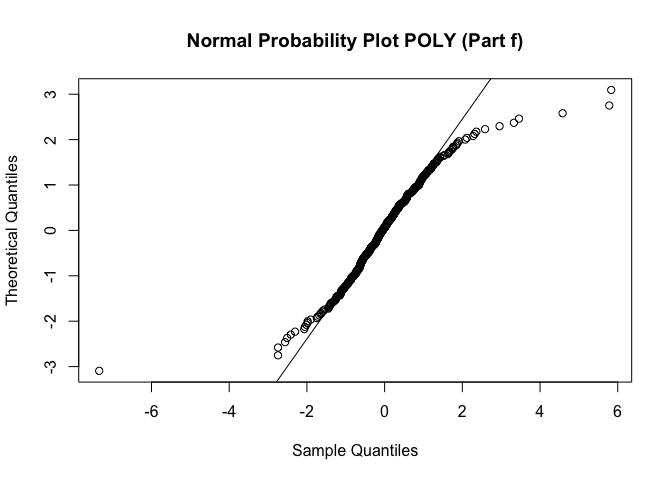<!-- -->

``` r
plot(fitted.values(f_poly_model), rstudent(f_poly_model), xlab = "y", ylab = "R-Student residuals", main = "Response vs. Residual Plot - POLY (Part f)")
abline(c(0,0), col="red")
```

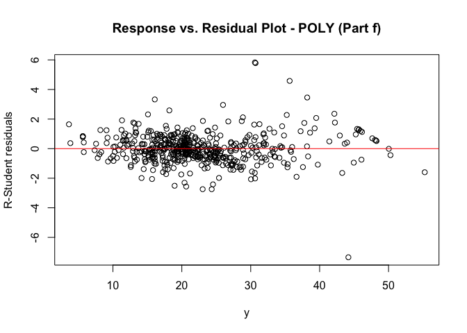<!-- -->

``` r
medvRep = sqrt(medv)
trans_f_poly_model = lm(medvRep ~ nox + rm +  dis + rad + lstat  + tax + dis*rad + crim*rm + zn*tax + rad*tax + rm*ptratio + tax*ptratio + crim*lstat + rm*lstat + dis*lstat + tax*lstat + SQdis + SQrad + SQlstat)
rStuRes = rstudent(trans_f_poly_model)
qqnorm(rStuRes, datax = TRUE, main="Normal Probability Plot TRANSFORMED POLY (Part f)")
qqline(rStuRes, datax = TRUE)
```

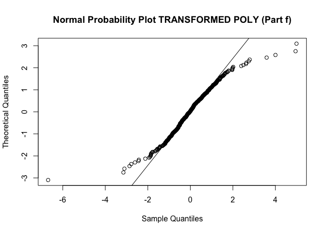<!-- -->

``` r
plot(fitted.values(trans_f_poly_model), rstudent(trans_f_poly_model), xlab = "y", ylab = "R-Student residuals", main = "Response vs. Residual Plot - TRANSFORMED POLY (Part f)")
abline(c(0,0), col="red")
```

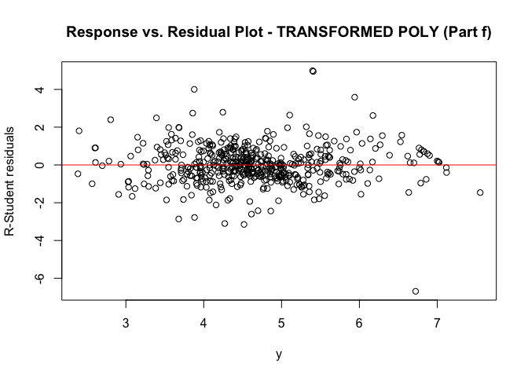<!-- -->

``` r
library(MASS)
bc = boxcox(medv ~ nox + rm +  dis + rad + lstat  + tax + dis*rad + crim*rm + zn*tax + rad*tax + rm*ptratio + tax*ptratio + crim*lstat + rm*lstat + dis*lstat + tax*lstat + SQdis + SQrad + SQlstat)
```

<!-- -->

``` r
lambda2 <- bc$x[which.max(bc$y)]
medvRep = medv^lambda2
model_box_cox_2 = lm(medv ~ nox + rm +  dis + rad + lstat  + tax + dis*rad + crim*rm + zn*tax + rad*tax + rm*ptratio + tax*ptratio + crim*lstat + rm*lstat + dis*lstat + tax*lstat + SQdis + SQrad + SQlstat)

summary(trans_f_poly_model)
```

    ## Call:
    ## lm(formula = medvRep ~ nox + rm + dis + rad + lstat + tax + dis * 
    ##     rad + crim * rm + zn * tax + rad * tax + rm * ptratio + tax * 
    ##     ptratio + crim * lstat + rm * lstat + dis * lstat + tax * 
    ##     lstat + SQdis + SQrad + SQlstat)
    ## 
    ## Residuals:
    ##      Min       1Q   Median       3Q      Max 
    ## -2.04278 -0.19256 -0.00914  0.19235  1.67284 
    ## 
    ## Coefficients:
    ##               Estimate Std. Error t value Pr(>|t|)    
    ## (Intercept)  1.462e+00  1.890e+00   0.773 0.439800    
    ## nox         -1.442e+00  3.128e-01  -4.608 5.21e-06 ***
    ## rm           1.471e+00  2.046e-01   7.193 2.44e-12 ***
    ## dis         -2.329e-01  6.499e-02  -3.584 0.000373 ***
    ## rad          4.350e-02  3.298e-02   1.319 0.187741    
    ## lstat        1.173e-01  4.283e-02   2.738 0.006408 ** 
    ## tax         -8.607e-03  2.858e-03  -3.011 0.002740 ** 
    ## crim        -3.601e-02  3.093e-02  -1.164 0.244824    
    ## zn           1.891e-03  3.589e-03   0.527 0.598492    
    ## ptratio      1.006e-01  1.000e-01   1.005 0.315190    
    ## SQdis        1.409e-02  4.273e-03   3.297 0.001050 ** 
    ## SQrad       -9.368e-03  3.778e-03  -2.480 0.013485 *  
    ## SQlstat      1.992e-03  4.535e-04   4.393 1.37e-05 ***
    ## dis:rad     -7.072e-03  2.814e-03  -2.513 0.012297 *  
    ## rm:crim      2.710e-03  4.046e-03   0.670 0.503237    
    ## tax:zn      -4.991e-06  1.170e-05  -0.427 0.669930    
    ## rad:tax      3.978e-04  1.907e-04   2.086 0.037518 *  
    ## rm:ptratio  -4.788e-02  1.158e-02  -4.136 4.17e-05 ***
    ## tax:ptratio  4.214e-04  1.393e-04   3.025 0.002622 ** 
    ## lstat:crim  -4.247e-05  4.686e-04  -0.091 0.927817    
    ## rm:lstat    -3.035e-02  4.984e-03  -6.090 2.30e-09 ***
    ## dis:lstat    2.555e-03  2.148e-03   1.190 0.234776    
    ## lstat:tax   -1.812e-04  2.462e-05  -7.362 7.86e-13 ***
    ## ---
    ## Signif. codes:  0 '***' 0.001 '**' 0.01 '*' 0.05 '.' 0.1 ' ' 1
    ## 
    ## Residual standard error: 0.3537 on 483 degrees of freedom
    ## Multiple R-squared:  0.8635, Adjusted R-squared:  0.8573 
    ## F-statistic: 138.9 on 22 and 483 DF,  p-value: < 2.2e-16

For this new and different model, I first analyzed the base model from part a) and removed regressors indus and age because they have absurdly high p-val’s for their respective regressor coefficient t-tests, suggesting very little ability to predict medv compared to all other regressors. \[Due to conflict with polynomial regression in the following step, I also had to remove regressor chas due to compiler error, please check to confirm you also get this strange error when including chas and trying to run poly w/ degree 2 or 3\]. This is probably a safer choice for regressor removal than what was previously done in part d) where I had to remove 4 additional regressors that arguably predicted medv quite well individually, (and mildly well jointly). Using the 9 other regressors, I studied interaction and quadratic terms by creating a full polynomial regression model of degree 2. The polynomial is far too complex, thus I selected only terms with significance to the model at the 5% level that are actually worth keeping. Lastly, after assessing the normal probability and residual plots, I felt that a transformation was needed and found through experimentation that root(y) reasonably improved the model’s variance of errors (variance no longer increases as much when fitted value increases). Box-Cox method actually produced lambda of 0.343, which appears close enough to 0.5 to validate the use of response transformation root(y). The R-sq value of 86% suggests that this transformed polynomial model explains the variability in medv considerably well, just as well as the polynomial model from part d) if not slightly better.

7.  Using your model in (f) detect 3 points from the data which you think are most probably outliers but not influential points. Detect pure leverage points and influential points (if no such points then say not detected, if there are more then 3 then write the most significant 3). Calculate the R-Student residuals at the points you find in this part.

``` r
library(olsrr)
```

    ## Attaching package: 'olsrr'

    ## The following object is masked from 'package:MASS':
    ## 
    ##     cement

    ## The following object is masked from 'package:datasets':
    ## 
    ##     rivers

``` r
ols_rsdlev_plot(trans_f_poly_model)
```

    ## Warning: 'ols_rsdlev_plot' is deprecated.
    ## Use 'ols_plot_resid_lev()' instead.
    ## See help("Deprecated")

``` r
rStuRes = rstudent(trans_f_poly_model)
r_stu_resids = c(rStuRes[392], rStuRes[402], rStuRes[410], rStuRes[381], rStuRes[365], rStuRes[369], rStuRes[411], rStuRes[415], rStuRes[354])
cbind(r_stu_resids)
```

    ##     r_stu_resids
    ## 392    2.7448794
    ## 402   -2.8600750
    ## 410    4.0036098
    ## 381    2.3942208
    ## 365   -6.6889403
    ## 369    3.5887138
    ## 411   -1.8695577
    ## 415    0.1330545
    ## 354   -0.4952076

Based on the Studentized Residuals vs Leverage Plot for my Transformed Polynomial Model from part f), I found that observations 392, 402, and 410 are non-influential outliers because they have high magnitude residuals but low leverage (remoteness in x-space). These observations lie in the top and bottom left regions of the plot; even though the top and bottom rows contain outliers due to high magnitude residuals, the top right and bottom right corners specifically contain influential points due to observations also having high leverage. Three particularly influential points are observations 381, 365, and 369. Pure leverage points have high remoteness in x-space but low residuals because they follow the regression model, lieing in the middle-left region. Three purely leverage points certainly are observations 411, 415, and 354. As expected, the outliers and influential points have relatively larger r-student residuals than purely leverage points, as shown in the table above.

8.  Check for multicollinearity in model part (a), part (d), and your model in part (f). Compare the differences in multicollinearity and discuss its possible causes.

``` r
library(car)
```

    ## Loading required package: carData

``` r
cat("Part a) Model VIF's:\n")
```

    ## Part a) Model VIF's:

``` r
vif(model)
```

    ##     crim       zn    indus     chas      nox       rm      age      dis 
    ## 1.767486 2.298459 3.987181 1.071168 4.369093 1.912532 3.088232 3.954037 
    ##      rad      tax  ptratio    lstat 
    ## 7.445301 9.002158 1.797060 2.870777

``` r
cat("Part d) Model VIF's:\n")
```

    ## Part d) Model VIF's:

``` r
vif(polymodel)
```

    ##        nox         rm        dis      lstat     SQ_dis   SQ_lstat    ptratio 
    ## 127.970128 108.573606  71.094616  46.749285  31.426061  23.257720  79.363050 
    ##        rad     nox:rm rm:ptratio    dis:rad  dis:lstat  lstat:rad 
    ##  29.004271 126.520100  90.831195   7.671370   9.019528  22.000714

``` r
cat("Part f) Model VIF's:\n")
```

    ## Part f) Model VIF's:

``` r
vif(trans_f_poly_model)
```

    ##         nox          rm         dis         rad       lstat         tax 
    ##    5.304836   83.386956   75.605704  332.860690  377.582812  936.891129 
    ##        crim          zn     ptratio       SQdis       SQrad     SQlstat 
    ##  285.680551   28.285687  189.366137   32.935006 3420.280406   46.264677 
    ##     dis:rad     rm:crim      tax:zn     rad:tax  rm:ptratio tax:ptratio 
    ##   11.046412  175.093857   28.759868 6048.429965  123.924458 1091.350660 
    ##  lstat:crim    rm:lstat   dis:lstat   lstat:tax 
    ##   34.211429  148.732853    9.651420   63.214165

High variance inflation factors were identified from part a), namely rad (7.45) and tax (9.00), suggesting an issue with multicollinearity and that regression coefficients may be inaccurate estimators for the model. However the VIF’s for the model in part a) pale in comparison to those in the polynomial models from parts d) and f). For part d)’s model, VIF is highest for regressor nox (127.97), and for part f)’s model, VIF is highest for interaction term rad\*tax (6048.43). Thus, all three models indicate problems with multicollinearity, especially with respect to the two polynomial models. While in part a) all VIF’s fell between 5 and 10, remarkably all but 2 VIF’s in part d) and all but 1 VIF in part f) are within 5 and 10. This may suggest our choice of utilizing polynomial models was the problem, as is expected. The introduction of squared-regressor terms for regressors with small ranges (dis and rad) may definitely have increased multicollinearity. One source of multicollinearity that probably is less of a concern here is the concept of an ‘overdefined model,’ since we have over 500 observations and under 20 regressors in each model, although choosing a smaller subset of regressors could help decrease multicollinearity in the case of too many regressors.
